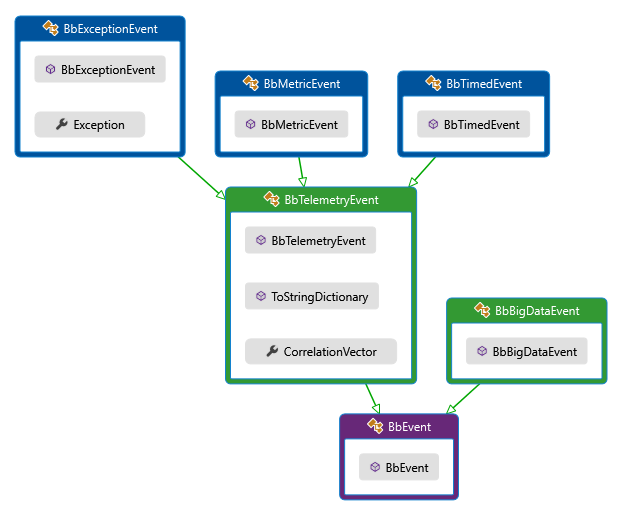

# Eshopworld.Telemetry

A telemetry abstraction, using an Application Insights based implementation through a Reactive Extensions pipeline.

### How does it work?

You instanciate `BigBrother` and then you use it to `Publish` events.
Ideally you store a singleton instance of `BigBrother` in your DI container and reference it by
it's interface `IBigBrother`.

### What are these events that I "publish"?

Events are strongly typed structures of data, written as
[POCOs](https://en.wikipedia.org/wiki/Plain_Old_CLR_Object).
They inherit from any of the base event types, except `BbEvent`. Currently the following event types are supported:


`BigDataEvent` isn't related to telemetry, it's purely here for showing the entire class structure. This special event type should only be used for events that aren't telemetry events but that should end up in the Data Lake store.

`BbAnonymousEvent` is an internal event that is used when calling `Publish` using an anonymous class. Internally we create one `BbAnonymousEvent` and attach the anonymous payload to is before we stream it down the pipeline.

**Here's a few examples:**
```c#
public class MyExceptionEvent : BbExceptionEvent
{
    public string WhinerMessage { get; set; }

    public string Message { get; set; }
}

public class PaymentEvent : BbTelemetryEvent
{
    public DateTime ProcessedOn { get; set; }

    public float Ammount { get; set; }

    public string Currency { get; set; }
}

public class PaymentAttemptEvent : BbTimedEvent
{
    public float Ammount { get; set; }

    public string Currency { get; set; }
}
```

Now that you have some events, publishing them is just:
```c#
IBigBrother bb = new BigBrother("[Application Insights Key]", "[Application Insights Key - For inner telemetry]");

bb.Publish(new PaymentEvent
{
    ProcessedOn = DateTime.Now,
    Ammount = 100,
    Currency = "USD"
});
```

Optionally, and especially useful during prototyping phases, you can publish anonymous classes:
```c#
IBigBrother bb = new BigBrother("[Application Insights Key]", "[Application Insights Key - For inner telemetry]");

bb.Publish(
    new 
    {
        ProcessedOn = DateTime.Now,
        Ammount = 100,
        Currency = "USD"
    });
```

The event will be named from the method name where the Publish was called from.

### Timed Events

Timed events, besides tracking the normal event custom dimensions will also measure a `ProcessingTime` metric and push it
to ApplicationInsights. The time window starts when the event is instantiated and finishes when the event is Published.

```c#
IBigBrother bb = new BigBrother("[Application Insights Key]", "[Application Insights Key - For inner telemetry]");

// Time starts being tracked here
var event = new PaymentAttemptEvent
            {
                Ammount = 100,
                Currency = "USD"
            });

// Do something that takes a while
Task.Delay(TimeSpan.FromMinutes(5)).Wait();

bb.Publish(event); // Time frame stops here
```

### How do I correlate events?

`BigBrother` plugs into the application insights correlation pipeline, so custom events will have `operation_id` but won't have `id`, this will be blank.

To facilitate even further and to plug into MVC better, we have a constructor that takes a `TelemetryClient` that in ASP.NET Core will be a singleton:
```c#
/// <summary>
/// Initializes a new instance of <see cref="BigBrother"/>.
///     Used to leverage an existing <see cref="TelemetryClient"/> to track correlation.
///     This constructor does a bit of work, so if you're mocking this, mock the <see cref="IBigBrother"/> contract instead.
/// </summary>
/// <param name="client">The application's existing <see cref="TelemetryClient"/>.</param>
/// <param name="internalKey">The devops internal telemetry Application Insights instrumentation key.</param>
public BigBrother([NotNull]TelemetryClient client, [NotNull]string internalKey)
{
}
```

### EventSource and Trace sinks

The package now supports trace and ETW sinks to all `BbExceptionEvents`. To set it up just use the fluent API:
```c#
var bb = new BigBrother("KEY", "INTERNAL KEY");
bb.UseEventSourceSink().ForExceptions();
bb.UseTraceSink().ForExceptions();
```

You can also sink to both `EventSource` and `Trace` before you reach the point where you can instanciate `BigBrother`
by using the static method `Error`

```c#
BigBrother.PublishError(new Exception());
```

Internally the Exception will be placed inside a `BbExceptionEvent` and that will be written to an `EventSource`
and a `Trace`. `BigBrother` will also replay anything sent through `PublishError` when it gets instanciated
so that you'll publish to Application Insights events raised before getting to the point of instanciating
`BigBrother`.

### Telemetry processors in the package

#### RoleNameSetter
Sets the RoleName if not already set to be the entry point assembly full name.
Useful in scenarios where the out-if-the-box interceptors won't set this for you, like
WebJobs. Here's an example on how to set it up:
```c#
var builder = TelemetryConfiguration.Active.TelemetryProcessorChainBuilder;
// optional, will default to entry assembly name if not specified
RoleNameSetter.RoleName = "myCustomAppName";
builder.Use((next) => new RoleNameSetter(next));
builder.Build();
```

### Telemetry initializers in the package

#### Environment Details
Adds additional environment values(tenant/region/etc) to telemetry for tracing purposes.
Very useful when trying to diagnose issues in AI logs

```c#
 using Microsoft.ApplicationInsights.Extensibility;
 
public void ConfigureServices(IServiceCollection services)
{
	services.AddSingleton<ITelemetryInitializer, Eshopworld.Telemetry.Initializers.EnvironmentDetailsTelemetryInitializer>();
}
```

### What can I also do with it?

You can force a Flush of the AI client, which will send all events right away:
```c#
bb.Flush();
```

You can also set the AI client to use a channel in DeveloperMode, this will push events right away
without streaming them in memory. If you're getting a release package (from nuget.org), this doesn't do anything
this is to force deployments to never have channels in DeveloperMode even if developers forget to remove the code.
```c#
bb.DeveloperMode();
```

### Do I just include this package for instrumentation?

Depends on what type of application you're writting. This only includes the
[core Application Insights package](https://www.nuget.org/packages/Microsoft.ApplicationInsights/),
so if your application can leverage other packages it should also include any of the top level AI packages.
For example, web applications should also include the
[Application Insights for Web package](https://www.nuget.org/packages/Microsoft.ApplicationInsights.Web/).

### What is this AI key for inner telemetry?

This is the Application Insights account where `BigBrother` pushes internal telemetry.
By design, `BigBrother` will never throw, but everytime an exception is raised,
it is stream to the inner telemetry account.
We also track certain events, to see if we have wrong usage of BigBrother,
for example we track all calls to `Flush`, so if you're pushing events and using `Flush` right after,
we know about it!

### I want to write some tests now, but I don't want to send events

`BigBrother` does a bit of heavy lifting on both it's constructor and the class static constructor,
so you should always stub `IBigBrother` instead, to avoid the heavy lifting done on the constructors.

`BigBrother` Can also be deconstructed to gain access to the internal Observables and Observers:
```c#
public void Deconstruct(out IObservable<BbEvent> telemetryObservable, out IObserver<BbEvent> telemetryObserver, out IObservable<BbEvent> internalObservable)
```

This can be used in Unit Tests to instead of verifying Publish calls, the test just subscribes to the internal streams
and asserts in the scope of that subscription. If you go down this route, be carefull with parallel tests and multiple
subscriptions and make sure you always dispose of subscriptions to those Observables at the end of the test.
