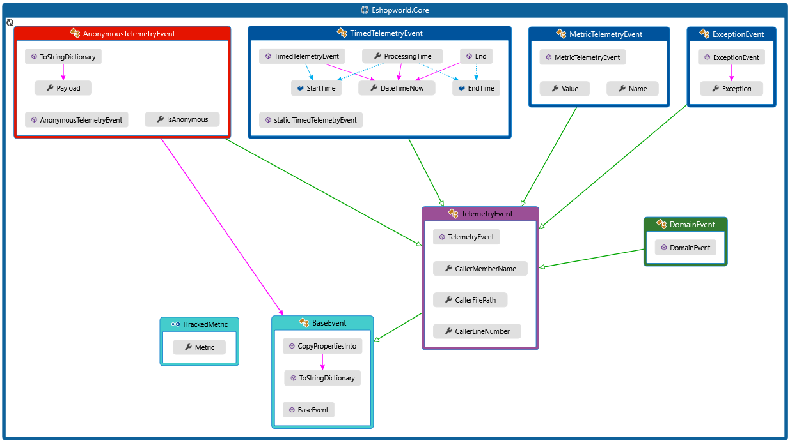

# Eshopworld.Telemetry

A telemetry abstraction, using an Application Insights based implementation through a Reactive Extensions pipeline.

## Getting started

You instanciate `BigBrother` and then you use it to `Publish` events.
Ideally you store a singleton instance of `BigBrother` in your DI container and reference it by
it's interface `IBigBrother`.

## Publishing events

Events are strongly typed structures of data, written as
[POCOs](https://en.wikipedia.org/wiki/Plain_Old_CLR_Object).
They inherit from any of the base event types, except `BbEvent`. Currently the following event types are supported:


`BbAnonymousEvent` is an internal event that is used when calling `Publish` using an anonymous class. Internally we create one `BbAnonymousEvent` and attach the anonymous payload to is before we stream it down the pipeline.

**Here's a few examples:**

```c#
public class MyExceptionEvent : ExceptionEvent
{
    public string WhinerMessage { get; set; }

    public string Message { get; set; }
}

public class PaymentEvent : TelemetryEvent
{
    public DateTime ProcessedOn { get; set; }

    public float Ammount { get; set; }

    public string Currency { get; set; }
}

public class PaymentAttemptEvent : TimedEvent
{
    public float Ammount { get; set; }

    public string Currency { get; set; }
}
```

Now that you have some events, publishing them is just:

```c#
IBigBrother bb = new BigBrother("[Application Insights Key]", "[Application Insights Key - For inner telemetry]");

await bb.PublishAsync(new PaymentEvent
{
    ProcessedOn = DateTime.Now,
    Ammount = 100,
    Currency = "USD"
});
```

Optionally, and especially useful during prototyping phases, you can publish anonymous classes:

```c#
IBigBrother bb = new BigBrother("[Application Insights Key]", "[Application Insights Key - For inner telemetry]");

bb.Publish(
    new 
    {
        ProcessedOn = DateTime.Now,
        Ammount = 100,
        Currency = "USD"
    });
```

The event will be named from the method name where the Publish was called from. There is a guard on the `Publish(object)` that will throw an `InvalidOperationException` if there is an attempt
to use that signature to publish a `TelemetryEvent`.

### Timed Events

Timed events, besides tracking the normal event custom dimensions will also measure a `ProcessingTime` metric and push it
to ApplicationInsights. The time window starts when the event is instantiated and finishes when the event is Published.

```c#
IBigBrother bb = new BigBrother("[Application Insights Key]", "[Application Insights Key - For inner telemetry]");

// Time starts being tracked here
var event = new PaymentAttemptEvent
            {
                Ammount = 100,
                Currency = "USD"
            });

// Do something that takes a while
Task.Delay(TimeSpan.FromMinutes(5)).Wait();

bb.Publish(event); // Time frame stops here
```

### Event correlation

`BigBrother` plugs into the application insights correlation pipeline, so custom events will have `operation_id` but won't have `id`, this will be blank.

To facilitate even further and to plug into MVC better, we have a constructor that takes a `TelemetryClient` that in ASP.NET Core will be a singleton:

```c#
/// <summary>
/// Initializes a new instance of <see cref="BigBrother"/>.
///     Used to leverage an existing <see cref="TelemetryClient"/> to track correlation.
///     This constructor does a bit of work, so if you're mocking this, mock the <see cref="IBigBrother"/> contract instead.
/// </summary>
/// <param name="client">The application's existing <see cref="TelemetryClient"/>.</param>
/// <param name="internalKey">The devops internal telemetry Application Insights instrumentation key.</param>
public BigBrother([NotNull]TelemetryClient client, [NotNull]string internalKey)
{
}
```

### Using Application Insights Metrics

BigBrother supports [Application Insights Metrics](https://docs.microsoft.com/en-us/azure/azure-monitor/app/api-custom-events-metrics#getmetric) with a similar usage as the one in the `TelemetryClient`, by doing:

```c#
bb.GetTrackedMetric<MyMetric>();
```

This will give you a `DynamicProxy` to your metric object that has an interceptor on the `Metric` property setter, everytime it's set, it will invoke a `TrackValue` call on the `Metric`.

The design starts with your own custom Metric type, that implements `ItrackedMetric` where any property of type string is considered a `Metric` dimension:

```c#
public class MyMetric : ITrackedMetric
{
    public virtual double Metric { get; set; } // needs to be marked as virtual

    public string DimensionOne { get; set; }

    public string DimensionTwo { get; set; }

    public string DimensionThree { get; set; }

    public int NotADimension { get; set; } // not considered a dimension - it's not of type string
}
```

Note that the `Metric` property needs to be marked as virtual, otherwise a call to `GetTrackedMetric` will throw an `InvalidOperationException` because `DynamicProxy` won't be able to set the interceptor.

The `Metric` dimensions are treated as keys, so each invididual set of dimension keys is aggregated on a different time series and pushed as a different metric to Application Insights. This is important because if a property is changed in the middle of metric values, that means the new values will be tracked on a new time series, here's an example:

```c#
var myMetric = bb.GetTrackedMetric<MyMetric>();
myMetric.DimensionOne = "one";
myMetric.DimensionTwo = "two";
myMetric.DimensionThree = "three";

myMetric.Metric = 1;
myMetric.Metric = 2;
myMetric.Metric = 3;

myMetric.DimensionOne = "not one";

myMetric.Metric = 4; // value 4 is now tracked on a different time series - dimensions have changed
```

To avoid this type of behaviour we advise developers to create a `Metric` object per set of metric keys and if possible, make the class immutable.

### Event Filters

`BigBrother` honours `EventFilter`, both when publishing to Application Insights and to Kusto. To use them just mark properties that you want to ignore:

```c#
public class PaymentEvent : DomainEvent
{
    public DateTime ProcessedOn { get; set; }

    public float Ammount { get; set; }

    public string Currency { get; set; }

    [EventFilter(EventFilterTargets.ApplicationInsights | EventFilterTargets.Messaging)]
    public string NotAKustoProperty { get; set; }

    [EventFilter(EventFilterTargets.ApplicationInsights)]
    public string JustForApplicationInsights { get; set; }
}
```

### Messaging integration

BigBrother contains a routing mechanism to `Messenger`, so that `DomainEvent` can be published onto [Azure Service Bus](https://azure.microsoft.com/en-us/services/service-bus/) Topics. To use it, simply set it up with:

```c#
bb.PublishEventsToTopics(new Messenger("MY CONNECTION STRING", "MY SUBSCRIPTION ID"));
```

`BigBrother` has no knowledge of messaging principles, it just acts as a forwarder, for `DomainEvent` to an instance of `Messenger`.

### Kusto (Azure Data Explorer) integration

There is a one time schema support for publishing certain Telemetry events to [Azure Data Explorer](https://azure.microsoft.com/en-us/services/data-explorer/).

We do not support schema changes in the current version, so if the event structure changes, the schema must be manually updated, or deleted before a new event can be sucessfully pushed.

The integration with Kusto uses [Managed Identities](https://docs.microsoft.com/en-us/azure/active-directory/managed-identities-azure-resources/overview), so it will require proper access during development sessions.

To use it just tell `BigBrother` to `.UseKusto`:

```c#
bb.UseKusto("ENGINE URI", "INGESTION URI", "DATABASE");
```

From this point forward all `TelemetryEvent` publishes that aren't an `ExceptionEvent` or a `TimedTelemetryEvent` will be streamed to the Kusto engine.

```c#
internal void SetupKustoSubscription()
{
    TelemetryStream.OfType<TelemetryEvent>()
                   .Where(e => !(e is ExceptionEvent) &&
                               !(e is TimedTelemetryEvent))
                   .Subscribe(HandleKustoEvent);
}
```

### EventSource and Trace sinks

The package now supports trace and ETW sinks to all `BbExceptionEvents`. To set it up just use the fluent API:

```c#
var bb = new BigBrother("KEY", "INTERNAL KEY");
bb.UseEventSourceSink().ForExceptions();
bb.UseTraceSink().ForExceptions();
```

You can also sink to both `EventSource` and `Trace` before you reach the point where you can instanciate `BigBrother`
by using the static method `Error`

```c#
BigBrother.PublishError(new Exception());
```

Internally the Exception will be placed inside a `BbExceptionEvent` and that will be written to an `EventSource`
and a `Trace`. `BigBrother` will also replay anything sent through `PublishError` when it gets instanciated
so that you'll publish to Application Insights events raised before getting to the point of instanciating
`BigBrother`.

### Telemetry processors in the package

#### RoleNameSetter

Sets the RoleName if not already set to be the entry point assembly full name.
Useful in scenarios where the out-if-the-box interceptors won't set this for you, like
WebJobs. Here's an example on how to set it up:

```c#
var builder = TelemetryConfiguration.Active.TelemetryProcessorChainBuilder;
// optional, will default to entry assembly name if not specified
RoleNameSetter.RoleName = "myCustomAppName";
builder.Use((next) => new RoleNameSetter(next));
builder.Build();
```

### Additional BigBrother features

You can force a Flush of the AI client, which will send all events right away:

```c#
bb.Flush();
```

You can also set the AI client to use a channel in DeveloperMode, this will push events right away
without streaming them in memory. If you're getting a release package (from nuget.org), this doesn't do anything
this is to force deployments to never have channels in DeveloperMode even if developers forget to remove the code.

```c#
bb.DeveloperMode();
```

### Extra package includes

Depends on what type of application you're writting. This only includes the
[core Application Insights package](https://www.nuget.org/packages/Microsoft.ApplicationInsights/),
so if your application can leverage other packages it should also include any of the top level AI packages.
For example, web applications should also include the
[Application Insights for Web package](https://www.nuget.org/packages/Microsoft.ApplicationInsights.Web/).

### Inner Telemetry instrumentation key

This is the Application Insights account where `BigBrother` pushes internal telemetry.
By design, `BigBrother` will never throw, but everytime an exception is raised,
it is stream to the inner telemetry account.
We also track certain events, to see if we have wrong usage of BigBrother,
for example we track all calls to `Flush`, so if you're pushing events and using `Flush` right after,
we know about it!

### Writing tests without sending events

`BigBrother` does a bit of heavy lifting on both it's constructor and the class static constructor,
so you should always stub `IBigBrother` instead, to avoid the heavy lifting done on the constructors.

`BigBrother` Can also be deconstructed to gain access to the internal Observables and Observers:

```c#
public void Deconstruct(out IObservable<BbEvent> telemetryObservable, out IObserver<BbEvent> telemetryObserver, out IObservable<BbEvent> internalObservable)
```

This can be used in Unit Tests to instead of verifying Publish calls, the test just subscribes to the internal streams
and asserts in the scope of that subscription. If you go down this route, be carefull with parallel tests and multiple
subscriptions and make sure you always dispose of subscriptions to those Observables at the end of the test.
